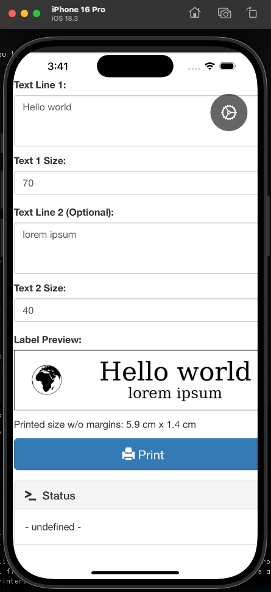

# Labels iOS App

A simple iOS app to access your label printer interface on your iPhone.

## Features

- Access your label printer at `http://192.168.0.203:8013/labeldesigner`
- Toggle between local network and Tailscale VPN access
- Settings menu to switch connection methods
- Clean, native iOS interface

## Setup Instructions

### 1. Open in Xcode

1. Open Xcode (make sure it's fully installed)
2. Click "Create a new Xcode project"
3. Select **iOS** → **App** → Click "Next"
4. Fill in the project details:
   - **Product Name:** Labels
   - **Team:** Select your Apple Developer account (or leave as "None" for simulator testing)
   - **Organization Identifier:** com.yourname (e.g., com.jason)
   - **Interface:** SwiftUI
   - **Language:** Swift
   - **Storage:** None
   - Uncheck "Include Tests"
5. Save the project to `/Users/T962973/dev/labels-xcode` (or any location)

### 2. Replace Project Files

Once the project is created:

1. In Xcode's left sidebar (Project Navigator), delete these files (Move to Trash):
   - `LabelsApp.swift`
   - `ContentView.swift`
   - `Info.plist` (if it exists in the file list)

2. In Finder, navigate to `/Users/T962973/dev/labels`

3. Drag and drop these files into your Xcode project (select "Copy items if needed"):
   - `LabelsApp.swift`
   - `ContentView.swift`
   - `WebView.swift`
   - `SettingsView.swift`
   - `Info.plist`

4. Replace the `Assets.xcassets` folder:
   - Delete the existing `Assets.xcassets` in Xcode
   - Drag the new `Assets.xcassets` folder from `/Users/T962973/dev/labels` into Xcode

### 3. Configure Project Settings

1. Click on the project name (Labels) at the top of the left sidebar
2. Under "Targets" → "Labels" → "Info" tab:
   - Make sure "Custom iOS Target Properties" shows the Info.plist settings
3. Under "Signing & Capabilities":
   - Select your Team (Apple Developer account)
   - Or for testing on simulator, you can leave it as is

### 4. Build and Run

1. Select your iPhone from the device dropdown (or use iPhone Simulator)
2. Click the Play button (▶️) to build and run
3. The app should launch and load your label printer interface

### 5. Install on Your iPhone

To install on a physical iPhone:

1. Connect your iPhone to your Mac
2. Trust the computer on your iPhone if prompted
3. In Xcode, select your iPhone from the device dropdown
4. Click Run (▶️)
5. On your iPhone, go to Settings → General → VPN & Device Management
6. Trust your developer certificate
7. The app will now run on your iPhone

## Usage

- **Access Label Printer:** Open the app to immediately access the label designer
- **Switch Networks:** Tap the gear icon (⚙️) in the top right to toggle between local network and Tailscale VPN
- **Settings:** The current URL is displayed in the settings screen

## Network Configuration

- **Local Network:** `http://192.168.0.203:8013/labeldesigner`
- **Tailscale VPN:** `http://100.105.104.117:8013/labeldesigner`

The app remembers your preference between launches.
